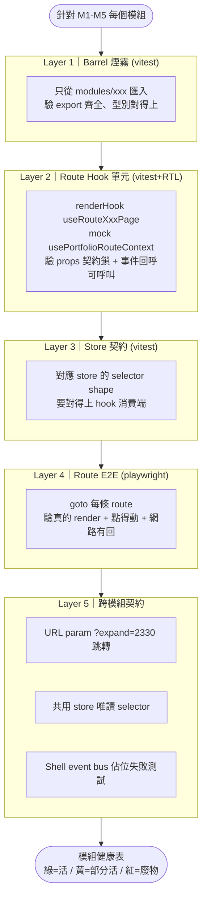

# 深模組活體檢查計畫

上一輪只做了「契約鎖形狀」的 unit test（`checkup-modules-contract.test.tsx` 只驗 hook return 的 key 存在），**沒有驗證任何一顆模組能在真實 route 下 render、能觸發 store、能打 edge function**。本計畫要回答一個問題：**這 5 顆深模組是活的還是紙糊的？**

## 現況盤點（已確認）

- **5 個 barrel**：`src/checkup/modules/{holdings,closing,events,tradeIO,research}/index.ts` 都已建立，各 export 1-3 個 `useRouteXxxPage` hook + Page + Panel。
- **7 條 route pages**：`HoldingsPage / DailyPage / NewsPage / EventsPage / TradePage / LogPage / ResearchPage`，全部掛在 `PortfolioLayout` 下。
- **5 個 store**：`holdingsStore / marketStore / reportsStore / eventStore / brainStore`。
- **既有測試**：只有 `checkup-modules-contract.test.tsx`（mock 光 `usePortfolioRouteContext`）+ 一堆 `holdings-*.spec.ts` e2e，其他模組 **零 e2e**。→ M2/M3/M4/M5 目前**沒有任何 runtime 證據**。

## 驗證流程圖



## 5 層測試金字塔（每顆模組都要跑一遍）

| 層 | 工具 | 產出檔 | 抓什麼 bug |
|---|---|---|---|
| L1 Barrel 煙霧 | vitest | `src/test/unit/checkup-module-barrel.test.ts` | barrel 忘記 re-export、路徑打錯 |
| L2 Route Hook 單元 | vitest + RTL | 每模組一支 `useRouteXxxPage.test.tsx` | hook 內部拿 undefined、setter 沒接、useMemo 依賴漏抓 |
| L3 Store 契約 | vitest | `src/test/unit/checkup-stores-contract.test.ts` | store selector 改名、hook 拿不到欄位 |
| L4 Route E2E | playwright | `e2e/portfolio-modules-smoke.spec.ts`（7 個 route × 1 describe 各自） | route 掛不上、Panel 白畫面、console error、fetch 500 |
| L5 跨模組 | vitest + playwright | `src/test/unit/module-cross-contract.test.ts` + `e2e/module-cross-nav.spec.ts` | M2→M1 跳轉走非法路徑、模組互相偷 import |

## 每個模組要跑的具體檢查

| 模組 | L4 路由 | 必須驗到的 runtime 訊號 |
|---|---|---|
| **M1 Holdings** | `/portfolio/demo/holdings` | Panel render、`holdingsStore` 有列、點列開 detail drawer、`current_prices` fetch |
| **M2 Closing** | `/portfolio/demo/daily` + `/news` | `reportsStore.dailyReport` 有值、觸發「重新分析」→ edge function `daily-analysis` 有回 |
| **M3 Events** | `/portfolio/demo/events` | `eventStore` 有事件卡、篩選 chip 切換、`EventCard` 點擊能展開 |
| **M4 TradeIO** | `/portfolio/demo/trade` + `/log` | Trade 頁 OCR 上傳按鈕在、Log 頁列表可切排序 |
| **M5 Research** | `/portfolio/demo/research` | Panel render、輸入 code → `runResearch` 呼叫、history 出現一筆 |

## 跨模組契約（L5 三條合法路）

1. **URL 跳轉**：E2E 從 `/events` 點事件卡的持倉 chip → 網址變 `/holdings?expand=2330` → M1 自動展開該股。
2. **共用 store 唯讀 selector**：unit test 用 `import { useHoldingsStore }`，assert 只能拿 selector，不能拿 `setState`（透過 mock 攔截失敗）。
3. **Shell event bus**：目前 TODO。先寫**一支預期失敗的 skip test** 佔位，實作 PR 再拿掉 skip。

## 產出物

執行完 5 層後，**產一份「模組健康表」寫進 `docs/architecture/holdings-modules.md` 底部**，欄位：

```text
| 模組 | L1 | L2 | L3 | L4 | L5 | 狀態 | 備註 |
```

狀態三色：**綠**=五層全綠；**黃**=L4 render 但互動壞；**紅**=L4 白畫面或掛不上（=廢物）。

## 執行順序（進 build mode 後）

1. 先寫 L1 + L3（快速、無 Playwright 依賴）→ 抓出 barrel / store 名字對不齊的低垂果實。
2. 補 L2 五支 hook 測試 → 補完 unit 層。
3. 寫 L4 一支 `portfolio-modules-smoke.spec.ts`（7 個 describe 塞同一檔），先用 demo portfolio route 掃一輪。
4. 寫 L5（URL 跳轉 e2e + store 唯讀 unit + event bus skip）。
5. 收集紅黃綠、更新架構文件、如遇紅色模組**當場開 fix PR**（不留待辦）。

## 技術細節

- Demo portfolio route：復用既有 `useFreeCheckupBootstrap` demo data 建 `demo` id，避免依賴登入。若 route 需要真 auth，用既有 e2e 的 `LOVABLE_BROWSER_SUPABASE_*` session 注入。
- L2 hook 測試沿用 `checkup-modules-contract.test.tsx` 的 `QueryClientProvider` wrapper 與 mock 集，但 **assert 從 key 存在升級成「呼叫 setter → 對應 mock 被叫」**。
- L4 每個 describe 都要 `page.on('console', ...)` 收 error，跑完 fail if any `console.error`。
- 不改 runtime code，只加測試；除非 L4 抓出紅色 → 才進 fix。

## 不做

- 不做 visual regression（已由 `holdings-*.spec.ts` 覆蓋）。
- 不清理 legacy dead code（獨立 PR，見架構文件 TODO）。
- 不實作 event bus（另立 PR）。

按下 Implement Plan 後我會照 1→5 順序執行並邊跑邊回報紅黃綠。
